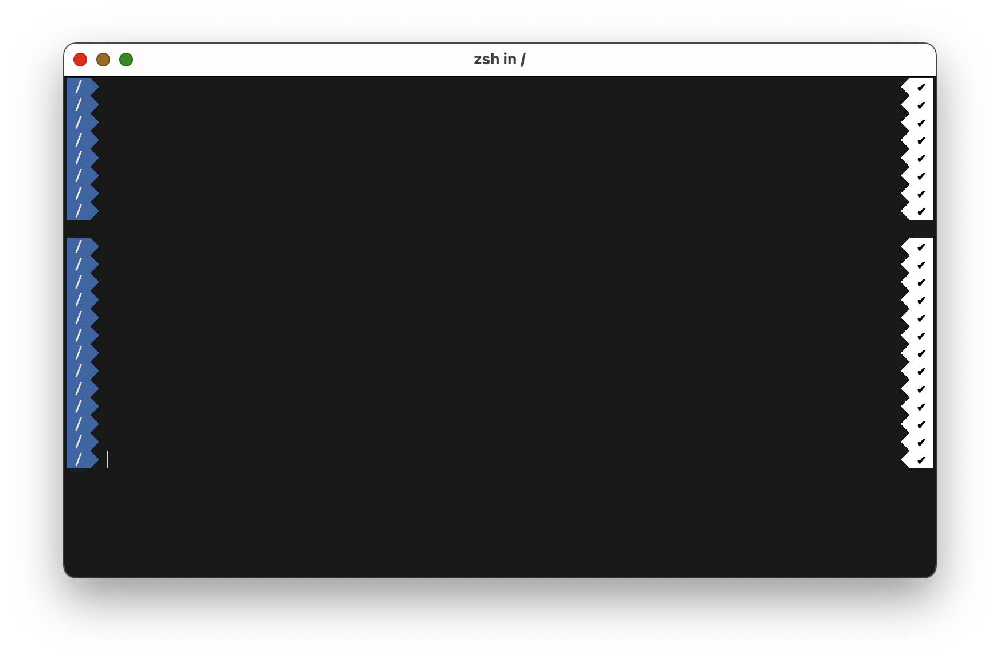
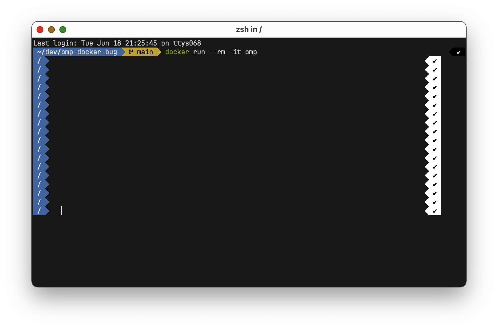

# oh-my-posh in Docker

```sh
docker build -t omp .
docker run --rm -it omp
```

## Expectation

No paddings when running outside of Docker:



## Reality

Running in Docker has these extra paddings:


